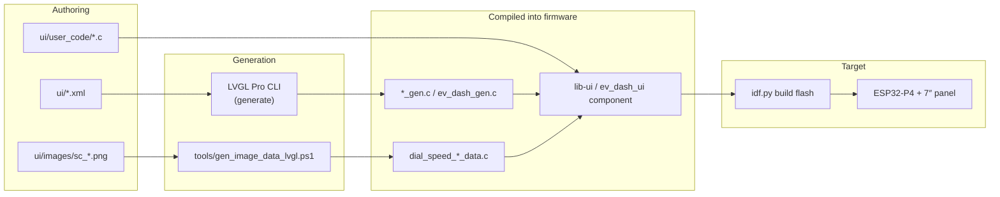

# EV Dash — LVGL UI

LVGL 9.5 instrument-cluster UI for an **ESP32-P4** electric-vehicle dashboard.

| | |
|---|---|
| **Display** | 1024 × 600 px · EK79007AD · MIPI-DSI |
| **Board** | [ESP32-P4-Function-EV-Board](https://docs.espressif.com/projects/esp-dev-kits/en/latest/esp32p4/esp32-p4-function-ev-board/user_guide.html) |
| **Toolchain** | ESP-IDF **6.0+** (tested with 6.0.1) |
| **UI authoring** | [LVGL Pro Editor](https://pro.lvgl.io) + XML in `ui/` |

---

## Repository layout

```
ev-dash-ui/
├── ui/                          # LVGL Editor project (source of truth for screens & widgets)
│   ├── project.xml              # Display 1024×600, LVGL 9.5, esp32p4 target
│   ├── globals.xml              # Fonts, colours, runtime subjects (CAN data bindings)
│   ├── screens/                 # screen_main.xml → screen_main_gen.c
│   ├── components/              # speedometer, speed_scale_ring, gauge_center_readout, …
│   ├── fonts/                   # JetBrains Mono TTF + generated font_*_data.c
│   ├── images/                  # PNG sources + generated *_data.c embeds
│   ├── user_code/               # Hand-written C (needle callback, dial asset setup, debug)
│   ├── user_config.cmake        # Extra sources linked into lib-ui
│   ├── ev_dash.c / ev_dash_gen.c
│   └── CMakeLists.txt           # Builds lib-ui (used by firmware)
│
├── firmware/                    # ESP-IDF app that flashes UI to hardware
│   ├── main/main.c              # BSP display init, ev_dash_init(), demo speed sweep
│   ├── main/idf_component.yml   # BSP, LVGL 9.5, USB (fetched on first build)
│   ├── components/
│   │   ├── ev_dash_ui/          # IDF component — lists every ui/*.c file to compile
│   │   └── espressif__esp_lvgl_port/  # Vendored LVGL port (local patches)
│   ├── sdkconfig.defaults       # P4, PSRAM, RGB565, tear avoidance, display options
│   └── README.md                # Firmware-specific quick reference
│
├── tools/                       # Image embed & debug scripts (PowerShell)
│   ├── gen_image_data.ps1       # Composite dial PNG + custom C embed
│   ├── gen_image_data_lvgl.ps1  # Same composite → official LVGLImage.py converter
│   └── gen_debug_draw_test.ps1  # Solid-colour test images for draw isolation
│
└── .github/workflows/preview.yml  # Validates XML & generates C on push
```

### How the pieces connect



1. **XML** defines screens, components, and widget layout. LVGL Editor (or CI) emits `*_gen.c` / `*_gen.h`.
2. **PNG sources** (`sc_dial_speed_*.png`) are composited and converted to embedded C arrays (`dial_speed_dial_data.c`, etc.) via `tools/`.
3. **`user_code/`** holds logic the editor cannot express: needle rotation callback, dial image setup, debug overlays.
4. **`firmware/components/ev_dash_ui/CMakeLists.txt`** is the manifest of every `ui/` source file linked into the IDF build. New generated `.c` files must be added here.
5. **`firmware/main/main.c`** initialises the BSP display, calls `ev_dash_init(NULL)`, loads `screen_main`, and runs a demo speed sweep.

---

## Prerequisites

### UI editing (browser or local)

- Git + push access to this repo
- Optional: [LVGL Pro Editor](https://pro.lvgl.io) or [viewer](https://viewer.lvgl.io/?repo=bobjwatts/ev-dash-ui)
- Optional local codegen: Node.js + [LVGL Pro CLI](https://github.com/lvgl/lvgl_editor/releases) (`lvgl-cli.zip`)

### Firmware (ESP32-P4)

- ESP-IDF **6.0+** with `esp32p4` target support
- Python (bundled with ESP-IDF) + `pypng`, `lz4` for image conversion
- USB cable to the board’s UART port
- Board wiring per the [P4 Function EV Board guide](https://docs.espressif.com/projects/esp-dev-kits/en/latest/esp32p4/esp32-p4-function-ev-board/user_guide.html) (PWM → GPIO26, LCD_RST → GPIO27)

---

## How to build — firmware (device)

Asset generation is **not** run automatically by `idf.py build`. Run the scripts when PNGs, formats, or dial size change.

### 1. ESP-IDF environment

PowerShell (adjust paths to your install):

```powershell
$env:IDF_TOOLS_PATH = "C:\Espressif"
$env:IDF_PYTHON_ENV_PATH = "C:\Espressif\tools\python\v6.0.1\venv"
$env:PATH = "C:\Espressif\tools\python\v6.0.1\venv\Scripts;" + $env:PATH
& C:\esp\v6.0.1\esp-idf\export.ps1
```

Or use the **ESP-IDF PowerShell** shortcut.

### 2. Generate dial / needle embeds

From the repo root:

```powershell
# Requires firmware/managed_components/lvgl__lvgl (run idf.py build once first)
.\tools\gen_image_data_lvgl.ps1

# Optional: solid test images for draw debugging
.\tools\gen_debug_draw_test.ps1
```

This writes (gitignored locally; regenerate after clone):

- `ui/images/dial_speed_dial_data.c`
- `ui/images/dial_speed_needle_data.c`
- `ui/images/ev_dash_assets.h`
- `ui/images/debug_img_*_data.c` (if debug script run)

Default dial format is **RGB565** (`-DialCf RGB565|RGB565A8`).

### 3. Build & flash

```powershell
cd firmware
idf.py set-target esp32p4   # first time only
idf.py build
idf.py -p COMx -b 115200 flash monitor
```

Replace `COMx` with your port. Use `-b 115200` if flash fails at higher baud.

### 4. After UI XML changes

Regenerate C from XML (see [UI workflow](#how-to-build--ui-preview--codegen) below), update `ev_dash_ui/CMakeLists.txt` if new `.c` files were added, then:

```powershell
cd firmware
idf.py build flash
```

### Clean rebuild

If you switch ESP-IDF versions or see stale embed warnings on serial:

```powershell
cd firmware
idf.py fullclean
idf.py build flash
```

### Serial log — what to expect

On boot, `main.c` logs asset id, dimensions, `data_size`, colour format, and debug flags. Example:

```
Embedded assets id=lvgl-439-rgb565-redbg-debug dial=439x439 ...
Dial color format: RGB565
Size debug rings ON: magenta=439 green=380 orange=409 px
```

---

## How to build — UI preview & codegen

### GitHub Actions (on push to `main`)

Workflow [`.github/workflows/preview.yml`](.github/workflows/preview.yml) validates XML and runs:

```bash
node ./lvgl-cli/lved-cli.js generate ui -ss
```

Generated `*_gen.c` / `*_gen.h` are uploaded as a CI artifact (30-day retention). Commit generated files locally if you want them in the repo without re-running the CLI.

### Browser preview

- **Viewer:** https://viewer.lvgl.io/?repo=bobjwatts/ev-dash-ui (reads XML from GitHub)
- **Pro Editor:** load `ui/project.xml`, optionally point **Preview → Custom runtime URL** at a WASM build

### Local C generation (optional)

```powershell
# Download CLI once (or use lvgl-cli.zip in repo root, gitignored)
curl -L https://github.com/lvgl/lvgl_editor/releases/download/v1.2.1/LVGL_Pro_CLI-1.2.1-linux-mac.zip -o lvgl-cli.zip
Expand-Archive lvgl-cli.zip -DestinationPath lvgl-cli

node ./lvgl-cli/lved-cli.js generate ui -ss
node ./lvgl-cli/lved-cli.js compile ui   # WASM preview runtime
```

---

## Runtime data model

Subjects in [`ui/globals.xml`](ui/globals.xml) bind widgets to vehicle data. Update from firmware with `lv_subject_set_*()`:

```c
#include "ev_dash_gen.h"

lv_subject_set_int(&speed_kmh, can_data.speed);
lv_subject_set_int(&state_of_charge_pct, can_data.soc);
lv_subject_set_float(&power_kw, can_data.power_kw);
```

| Subject | Type | Description |
|---|---|---|
| `speed_kmh` | int | Vehicle speed |
| `state_of_charge_pct` | int | Battery SoC 0–100 |
| `power_kw` | float | Motor power (+ discharge / − regen) |
| `battery_voltage_v` | float | Pack voltage |
| `battery_current_a` | float | Pack current |
| `batt_temp_c` | int | Battery temperature |
| `motor_temp_c` | int | Motor temperature |
| `inverter_temp_c` | int | Inverter temperature |
| `motor_rpm` | int | Motor RPM |
| `gear` | int | GearPosition enum |
| `regen_level` | int | Regen paddle 0–3 |
| `odometer_km` | int | Odometer |
| `trip_km` | int | Trip meter |
| `range_est_km` | int | Estimated range |
| `energy_kwh_remaining` | int | Usable energy remaining |
| `sys_state` | int | SysState enum |
| `fault_code` | int | Active fault (0 = none) |

The speedometer component binds `speed_kmh` to scale rings and `speed_needle_angle` (updated in `user_code/speedometer_needle.c`) for needle rotation.

---

## Image asset pipeline

| Step | Tool | Output |
|---|---|---|
| Edit PNGs | — | `ui/images/sc_dial_speed_face.png`, `_border`, `_needle` |
| Composite 439×439 dial | `gen_image_data.ps1` | `_debug_dial_full.png` (intermediate) |
| Convert to C | `gen_image_data_lvgl.ps1` → `LVGLImage.py` | `dial_speed_dial_data.c`, `dial_speed_needle_data.c` |
| Metadata header | same script | `ev_dash_assets.h` (`EV_DASH_ASSETS_ID`, sizes, format) |
| Runtime setup | `user_code/speedometer_assets.c` | 1:1 image scale, pivot, debug overlays |

Needle is embedded at native size (23×191). Dial face + border are baked into a single 439×439 bitmap aligned to the speedometer widget.

---

## Known issue — large bitmap draw on ESP32-P4

We are actively debugging a **device-only rendering bug** affecting large `lv_image` bitmaps on the P4 + EK79007 panel. Small images and vector widgets render correctly.

### Symptoms

- **439×439 dial** bitmap appears ~2× oversized, off-centre, and clipped (red debug corner visible at top-left of art).
- **Needle** (23×191), **vector debug rings** (magenta 439, orange 409, green 380), and **scale rings** draw at the correct size and position.
- Serial logs confirm widget coords are correct (`dial img` ≈ 439×439, `scale=256`).

### What we ruled out

| Hypothesis | Result |
|---|---|
| Stale firmware / wrong embed linked | Clean builds; serial confirms correct `data_size` and dimensions |
| Custom embed script truncation | Byte counts match official converter; PC composite is centred |
| PNG artwork / transparency | Solid 439×439 **cyan RGB565** test image shows same striping |
| Colour format alone | RGB565, RGB565A8, ARGB8888 — same broken appearance |
| Runtime image scaling | Removed from XML; `speedometer_image_set_1to1()` enforces scale 256 |
| Widget layout | `lv_obj` bounds match 439×439 in `speedometer_debug_log_dial_layout()` |

### Isolation tests

| Test image | Size | Format | On-device result |
|---|---|---|---|
| `debug_img_100` | 100×100 | RGB565A8 | ✅ Correct |
| `debug_img_439` | 439×439 | RGB565A8 | ❌ Striped / oversized |
| `debug_img_439_rgb565` | 439×439 | RGB565 | ❌ Same as above |
| Solid cyan (no art) | 439×439 | RGB565 | ❌ Same — **not an art bug** |

**Conclusion:** Bug is in the **large (~439 px) RGB565/RGB565A8 image draw path** on ESP32-P4 (LVGL SW draw and/or `esp_lvgl_port` flush with avoid-tear + DSI), not in asset generation or layout.

### Debug flags (`ui/user_code/speedometer_assets.h`)

| Flag | Default | Purpose |
|---|---|---|
| `SPEEDOMETER_DEBUG_SIZE_RINGS` | `1` | Vector rings overlaid on dial for size reference |
| `SPEEDOMETER_DEBUG_SIMPLE_CENTER` | `1` | Single centred speedometer (no side panel) |
| `SPEEDOMETER_DEBUG_DIAL_SOLID` | `1` | Swap dial art for solid cyan 439×439 RGB565 |
| `SPEEDOMETER_DEBUG_HIDE_READOUT` | `0` | Hide centre speed readout |

Set flags to `0` and rebuild once a workaround lands.

### Likely next steps

1. **Tile workaround** — render dial as a grid of ≤100 px (or ~220 px) RGB565 tiles (100×100 images work on device).
2. **Display path experiments** — `buff_dma=false` in `main.c`; try `CONFIG_BSP_DISPLAY_LVGL_FULL_REFRESH=n` in `sdkconfig.defaults`.
3. **LVGL / port investigation** — large blits in `lv_draw_sw_img.c`, `esp_lvgl_port_disp.c` flush path on RISC-V P4.

---

## Git ignore notes

Generated embeds and build artifacts are gitignored (see [`.gitignore`](.gitignore)). After clone:

```powershell
.\tools\gen_image_data_lvgl.ps1
cd firmware && idf.py build
```

To commit baked assets instead, remove the `ui/images/dial_speed_*` lines from `.gitignore`.

---

## Further reading

- [`firmware/README.md`](firmware/README.md) — ESP-IDF paths, flash tips, component layout
- [`ui/images/README.md`](ui/images/README.md) — PNG sources for dial assets
- [ESP32-P4 Function EV Board](https://docs.espressif.com/projects/esp-dev-kits/en/latest/esp32p4/esp32-p4-function-ev-board/user_guide.html)
